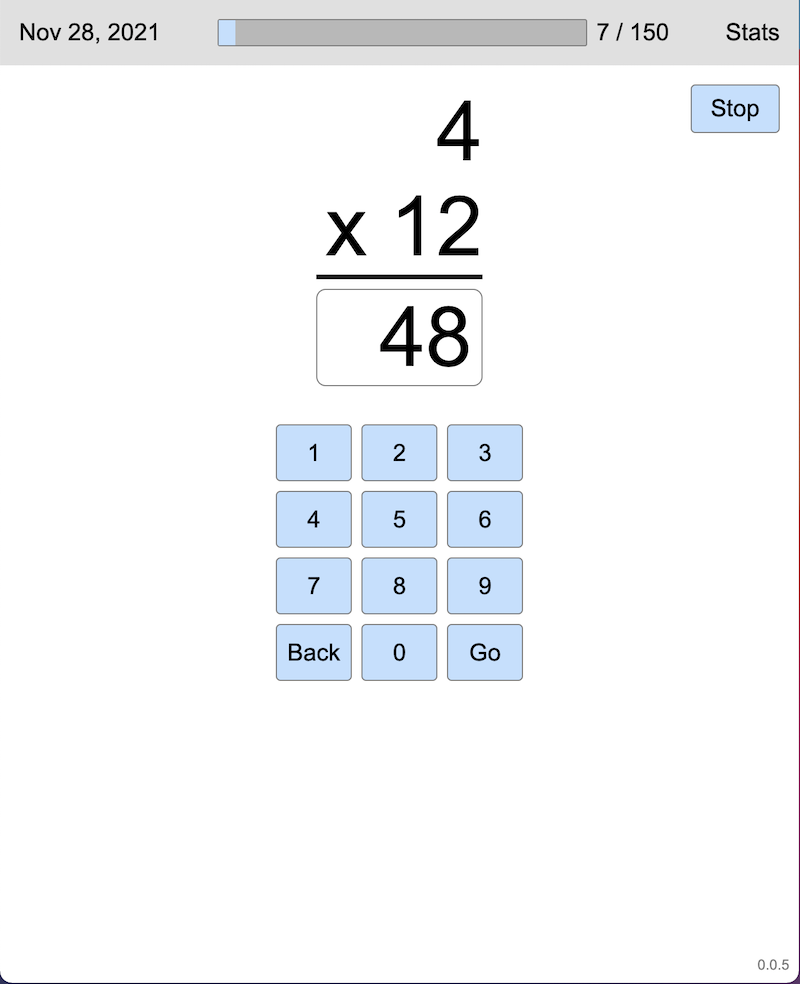

# Multiply
by Phil Mass

## Description
An app I made quickly to help my son learn his multiplication facts. You have to answer 150 questions each day, which covers all of the facts between 2 and 12, and some repeats of the problems that you miss the most. Various statistics are provided per day and per problem. On his request, it also involves a lot of confetti.

Deployed at [https://philrmass.github.io/multiply/](https://philrmass.github.io/multiply/)

## Legal
MIT license

